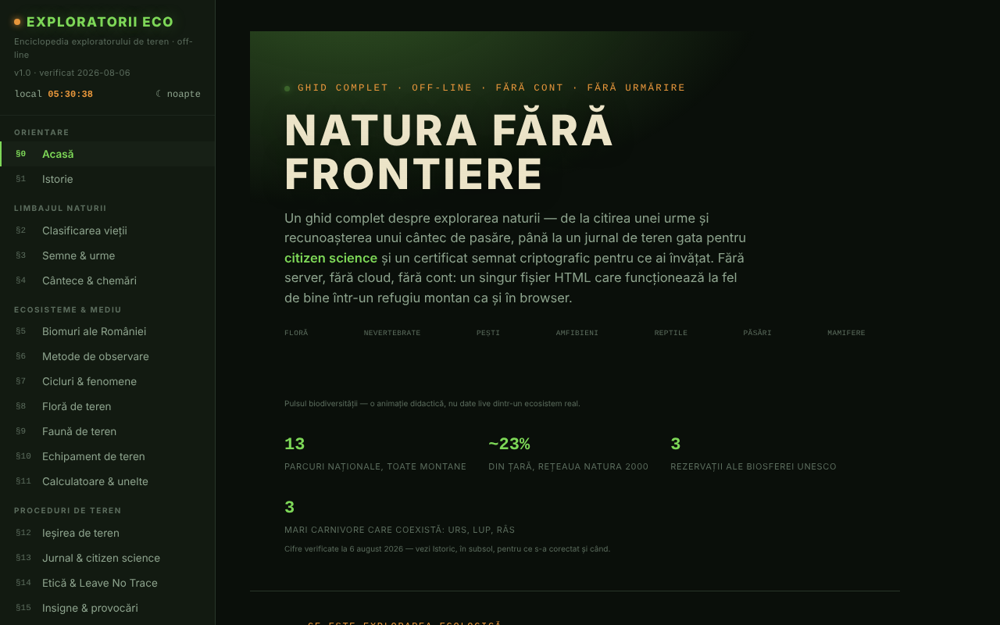

# Exploratorii Eco

Enciclopedia exploratorului de teren: ghid de natură, jurnal de observații și unelte de teren într-un singur fișier HTML.

**Live:** https://chiuta.github.io/ExploratoriiEco/

## Ce este

Un ghid complet pentru explorarea naturii, în 20 de secțiuni (§0–§19): clasificarea vieții, semne și urme, cântece și chemări, biomuri ale României, metode de observare, floră și faună de teren, echipament, calculatoare, proceduri de teren, jurnal și citizen science, etică (Leave No Trace), insigne, urgențe, arii protejate, test de cunoștințe și glosar A–Z. Conținutul este educațional; pentru decizii importante (acces în arii protejate, specii strict protejate, urgențe) aplicația trimite la ANMAP și Salvamont România ca surse autoritare.

## Funcții

- Navigare pe secțiuni din meniul lateral (☰ pe mobil); temă **Noapte / Zi** (butoanele ☾ / ☀).
- **Calculatoare și unelte** (§11): indice de biodiversitate Shannon–Wiener, locator Maidenhead, azimut și distanță spre o țintă (cu busolă live, dacă dispozitivul o permite), răcirea aerului cu altitudinea, amprenta de carbon a unei deplasări, sechestrare de carbon pentru copaci. Calculele se fac local, în pagină.
- **Antrenor de chemări** (§4): tonuri sintetizate (nu înregistrări reale) pentru recunoașterea unor tipare, plus citirea cu voce a denumirii onomatopeice prin sinteza vocală a browserului, dacă este disponibilă.
- **Jurnal de teren** (§13): adaugi observații (specie, număr, dată, oră, loc, comportament, note), cu completare a locului din GPS la cerere; export și import `.json`, partajare ca fișier.
- **Test de cunoștințe** (§18): mod aleator sau pe categorii, scor, progres pe categorii cu export/import.
- **Identitate locală și certificate**: generare de cheie ECDSA P-256 în browser, certificat auto-semnat al categoriilor stăpânite (minimum 80% corect și 5 întrebări pe categorie), verificare, „martor”, revocare. Nu este o diplomă oficială.
- **Glosar A–Z** cu căutare și notițe proprii (export/import).
- Insigne calculate din jurnal și din testul de cunoștințe, cât timp pagina este deschisă.
- **Printează secțiunea curentă**, mod ecran complet pentru test, buton „Raportează o eroare” (deschide formularul de issues GitHub).
- **Verifică integritatea fișierului**: la cerere, calculează SHA-256 al fișierului servit.

## Manual de utilizare

1. Deschide pagina și alege o secțiune din meniul din stânga.
2. Pentru jurnal, mergi la „§13 Jurnal & citizen science”, completează câmpurile și apasă **+ Adaugă observație**; apoi **💾 Exportă (.json)** pentru a păstra datele.
3. Pentru a relua jurnalul, apasă **📂 Importă** și alege fișierul exportat anterior.
4. Pentru calculatoare, mergi la „§11 Calculatoare & unelte”; butoanele „📍 Folosește locația mea” cer permisiunea de localizare a browserului.
5. La „§18 Test cunoștințe” alege o categorie sau răspunde direct; **💾 Exportă progresul** și **📂 Importă progresul** păstrează rezultatele între vizite.
6. Pentru un certificat: **🔑 Generează identitate**, apoi **📜 Generează certificat**; exportă identitatea ca rezervă.
7. Schimbă tema cu **☾ Noapte / ☀ Zi**; imprimă secțiunea curentă cu **🖨️ Printează secțiunea curentă**.

## Avertisment

Conținut educațional/orientativ. Secțiunile despre urgențe, șerpi, căpușe, ciuperci și plante nu înlocuiesc un curs de prim ajutor, sfatul medical sau autoritățile (112, Salvamont, ANMAP); plantele și ciupercile nu se consumă pe baza ghidului. Aplicația afișează o notă în același sens în subsol. „Certificatele" generate sunt dovezi auto-semnate ale progresului propriu, nu diplome oficiale.

## Confidențialitate și rețea

- **Stocare:** aplicația nu folosește localStorage, sessionStorage sau IndexedDB. Jurnalul, scorurile, notițele din glosar și identitatea criptografică stau doar în memorie și dispar la reîncărcarea paginii, dacă nu le exporți.
- **Rețea:** pagina nu încarcă scripturi, fonturi sau imagini externe și nu are analytics. Singura cerere de rețea este la cererea utilizatorului: butonul „Verifică integritatea fișierului” re-citește fișierul de la adresa de unde este servit. Linkurile din subsol (ANMAP, iNaturalist, GBIF, IUCN, Salvamont, fiipregatit.ro, GitHub, TROM, Patreon) se deschid doar la clic.
- Permisiuni ale browserului cerute doar la acțiune: localizare (GPS), orientare/busolă, sinteză vocală, partajare de fișiere.

## Rulare locală / offline

Descarcă `index.html` și deschide-l în browser. Aplicația funcționează fără internet; verificarea integrității poate fi blocată de browser pentru fișiere deschise direct de pe disc (aplicația afișează un mesaj în acest caz).

## Licență

Licența nu este încă declarată explicit în acest repository; vezi nota din aplicație. (Aplicația nu conține o mențiune de licență în text.)

## Audit

Audit: 2026-10-10 — verificat cu Playwright și axe-core (toate cele 20 de secțiuni, ambele teme); fără `localStorage`; jurnalul și importul testate cu `` (escapat). Corectate: titluri invizibile în tema „Zi" (text alb pe fundal deschis), contrast, listă de definiții invalidă în glosar.

## Autor

Alexio — Alexandru-Ionuț Chiuță. Aplicația trimite din subsol la Centrul STRING (CSPCF). Contact: alexio@trom.tf

## English summary

Exploratorii Eco is a single-file Romanian-language field naturalist's encyclopedia: 20 sections, calculators (Shannon–Wiener index, Maidenhead locator, bearing, lapse rate, carbon), a field journal with JSON export/import, a quiz, and locally generated signed certificates (ECDSA). It uses no browser storage (state is lost on reload unless exported) and makes no network requests except an optional file-integrity check. License not yet declared.
